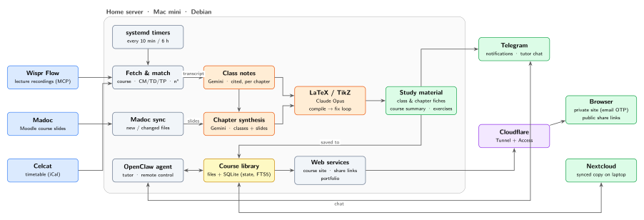

# classautomation

A self-hosted study pipeline. Lecture recordings and course slides go in; LaTeX revision sheets,
interactive exercises and a private, searchable course site come out, automatically, on a 2014 Mac mini.

  

## How it works

1. **Collect**: lectures are recorded with Wispr Flow; course slides are pulled from Moodle every 6 h.
2. **Match**: each recording is matched to the timetable: course, CM / TD / TP, number. Nothing to name by hand.
3. **Write**: Gemini turns the transcript + slides into cited class notes, then merges every class of a chapter.
4. **Typeset**: Claude Opus writes LaTeX / TikZ; a compile → fix loop guarantees a valid PDF.
5. **Publish**: fiches, exercises and course summaries land in a synced library, a private website and on Telegram.

## What you get

- **Per class** a fiche (`CM07 - 06-10.pdf`), **per chapter** a full revision sheet, **per course** a summary.
- Clickable sources: every claim links to the exact slide page.
- Interactive exercises (3 levels, auto-checked answers, worked solutions) with saved progress.
- A file-explorer style course site with full-text search, behind email login.
- One-click share links for a single PDF: expiry, view limit, optional password, visit log.
- A Telegram tutor that sends fiches, quizzes weak spots and drives the pipeline.

## Stack

| Layer | Tools |
|---|---|
| Server | Mac mini 2014 · Debian 13 · systemd timers & user services |
| Pipeline | Python 3.13 · FastAPI · SQLite (WAL, FTS5) · httpx · BeautifulSoup · MCP SDK |
| AI | Gemini 3.8 Flash (notes, synthesis, exercises) · Claude Opus 5.5 via Claude Code (LaTeX) |
| Typesetting | TeX Live · latexmk · TikZ · tcolorbox |
| Sources | Wispr Flow (MCP) · Moodle · Celcat iCal |
| Agent | OpenClaw · Telegram Bot API |
| Web | Vanilla JS · KaTeX · marked · Next.js + shadcn/ui + Magic UI (portfolio) |
| Network & sync | Cloudflare Tunnel + Access · Tailscale · Nextcloud |

## Repository

This repository only documents the architecture. The source code is private.
The diagram is generated from [`docs/architecture.tex`](docs/architecture.tex) (TikZ).
